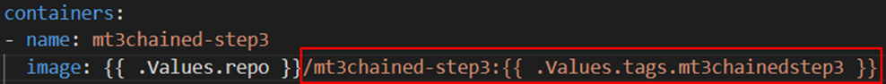
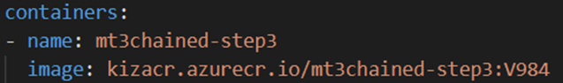
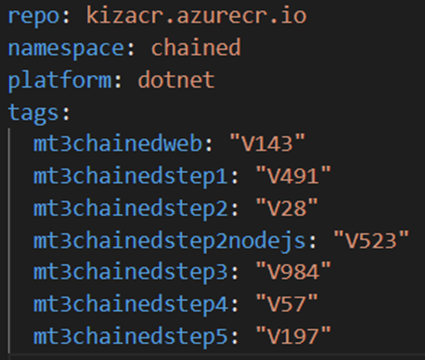

# Create Complex Microservices CI/CD Pipelines Using Helm and Azure Key Vault


1. The first part of the file lists which branch triggers the build.

```yaml
trigger:
- master
```

2. The *resources* section defines which repos to use in the build.  Since this pipeline will reference *step1* and ***App*** repos, both have to be defined here.

```yaml
resources:
  repositories:
  - repository: self  
  - repository: MyAppRepo 
    name: MyApp
    type: git
```

3. The ***variables*** section lists all the setting used later in the build.  Update the variables below based on your settings.
    
```yaml
variables:  
  dockerRegistryServiceConnection: 'ACRConnection'
  imageRepository: 'myacrRepo'
  containerRegistry: 'myacr.azurecr.io'
  dockerfilePath: '$(Agent.BuildDirectory)/Dockerfile'
  selfRepoPath: 'myRepoApp'
  tag: 'v$(Build.BuildId)'
```

> Notice the *dockerfilePath* variable is set to a folder containing the file relative to the root.  In this case, the root will be **$(Agent.BuildDirectory)**.

4. The *vmImageName* indicates the image to use for the build agent.

```yaml
  vmImageName: 'ubuntu-latest'
```

5. The *stages* define the stages of the pipeline.  In this case, it will only contain the **build** stage.
    
```yaml
stages:
- stage: Build
  displayName: Build and push stage
  jobs:
  - job: Build    
    displayName: Build
    pool:
      vmImage: $(vmImageName)
```

6. The *steps* section is where most of the work takes place in a pipeline.  The first two steps will checkout code from the two repositories and place them in specific folders, relative to the root. 

```yaml
    steps:
    - checkout: MyApp 
      path: MyAppRepo     
    - checkout: self
      path: MyAppRepo/
```

7. The *task* section will execute the Docker **Build** and **Push** commands, using the variables defined previously.
    
```yaml
    - task: Docker@2      
      displayName: Build and push an image to container registry
      inputs:
        command: buildAndPush
        repository: $(imageRepository)
        buildContext: $(Agent.BuildDirectory)
        dockerfile: $(dockerfilePath) 
        containerRegistry: $(dockerRegistryServiceConnection)
        tags: |
          $(tag),latest
```

> Notice that there are multiple tags.  This will ensure that 2 images are built and pushed in the pipeline: current build and latest.      

8. **Update the ACR name, the image repo and folder names in the file and copy its contents into the pipeline text in Azure DevOps.** 

9. Save and run the pipeline.
    
10. The first time the pipelines run it needs permission to access the **MyApp** repo.


11. Click the **View** button then **Permit**, then **Permit** again.

 
    
12. Assuming all the settings are correct, you should see 2 images in you Azure Container Registry


    
13. After all the builds have completed, verify all the images have been created in the ACR.


### Configure Key Vault 

You created an Azure Key Vault set it's name in the **$KV_NAME** variable.

1. On your Azure DevOps page, **Project setting** at the bottom of the side menu.

2. Select **Service connections** from the side menu.  Click the **Create service connection** button.

3. Select **Azure Resource Manager** from the available connection types.
   
4. Select **Service principal (automatic)** for the Authentication Method.
   
5. Select **Subscription** for the Scope level.  Login into your subscription.
   
6. Select your subscription and Resource Group.  
   
7. Call the service connection "**Azure Connection**" and save it.

8. When the service connection was created in Azure DevOps, it created a service principal in Azure to use during the connection.  You'll now need to give that service principal writes to update secrets in your key vault.

9. When the service connection has been created, click on it to view its details
   
10. Click on the "**Manage Service Principal**" link. 


11. This action will ask you to login to Azure and take you to the newly create service principal.  Take note of the Application ID of the service principal.

13. Create an Access Policy to allow Azure DevOps to read and write secrets to the Key Vault

```PowerShell
$OBJ_ID=$(az ad sp show --id $SP_ID --query objectId -o tsv)
az keyvault set-policy --name $KV_NAME `
                       --resource-group $AKS_RESOURCE_GROUP `
                       --object-id $OBJ_ID `
                       --secret-permissions delete get list set 
```

14. Open the Azure Portal, go to the Kay Vault and click on **Access policies** to verify the access policy was created


15. Create the default image tags secrets for all the images.  Set the default tags to *latest* so you can use them until they're replaced with the build numbers in the pipelines

```PowerShell
az keyvault secret set --vault-name $KV_NAME --name "myapp-tag" --value "latest"
az keyvault secret set --vault-name $KV_NAME --name "myapp2-tag" --value "latest"

```

16. On the Key Vault in the Azure Portal, click on **Secrets** to verify they were all created (you may need to click *Refresh*)
                       

### Task 4 - Update the Build Pipeline to store image tags in Azure Key Vault

1. Edit the build pipeline create in Task 2.
   
2. Add 2 variables after the *tag*.  Replace the *vaultName* with your Key Vault name.

```yaml
  tag: 'v$(Build.BuildId)'
  vaultName: 'myKVName'
  secretTagName: 'myapp1-tag'
```

> Notice the *secretTagName* matches the secret name created in the previous task.

3. Add another task to the end of your pipeline.  The pipeline will execute the same **az keyvault secret set** command that you executed above, except the *value* will be set to the current build tag.

```yaml
    - task: AzureCLI@2
      inputs:
        azureSubscription: 'Azure Connection'
        scriptType: 'bash'
        scriptLocation: 'inlineScript'
        inlineScript: |
          az keyvault secret set --vault-name "$(vaultName)" --name "$(secretTagName)" --value "$(tag)"
```


5. Save and run the pipeline.

6. When the build completes successfully, go to the Azure Portal and look up the secrets in the key vault.
   
7. Click on the link below the **CURRENT VERSION** of the secret.  Click the **Show Secret Value** button
   
8. The latest build tag should be in the value of the secret.

9. Which should match the latest tag in the ACR repository


### Build a single Release Pipelines that uses Helm to update the AKS cluster

Now that all of the microservice images are automatically built, push and their tags are saved, it's time to build a release pipeline that triggers automatically and updates the AKS cluster when **ANY** microservice is updated.


1. Remember the **values.yaml** file contains placeholders for all the microservice tags

Original **values.yaml**:

```yaml
tags:
  myapp1: latest 
  myapp2: latest 
  myappN: latest  
```
The goal of this task is to replace all those placeholders with the real tags.

First we need to retrieve the tags from key vault 

```yaml
      # Get secrets
      - name: Get Keyvault secrets
        uses: Azure/get-keyvault-secrets@v1
        with:
          keyvault: ${{ env.KV_NAME }}
          secrets: 'myapp1-tag,myapp2-tag,myappN-tag
        id: versiontags

      - name: 'Set version tags'
        uses: microsoft/variable-substitution@v1 
        with:
          files: myhelrepo/values.yaml
        env:
          tags.myapp1: ${{ steps.versiontags.outputs.myapp1-tag }}
          tags.myapp2: ${{ steps.versiontags.outputs.myapp2-tag }} 
          tags.myappN: ${{ steps.versiontags.outputs.myappN-tag }} 
          

````

Once our AKS context is set, we must install Helm.

```yaml
      - name: Helm tool installer
        uses: Azure/setup-helm@v1
```

11. Finally, we just have to run the Helm command to install/upgrade a release.

```yaml
      - name: Deploy
        run: |
          helm upgrade --install myapp1 myapp1Repo/
```


A RegEx task updates all the tags in a copy of the values.yaml file.

A Helm task uses the updated values file to upgrade the chart:

	helm upgrade myrelease mychart –-install –f updatedvalues.yaml






Updated **values.yaml**:



#### The complete workflow for the Helm repository will look like this:

```yaml
name: MYAPP1-HELM-RELEASE or Chained-Release

on:
  workflow_dispatch: ~
  push:
    branches: [main]

env:
  KV_NAME: <azureKeyVaultName>
  AKS_NAME: <aksName>
  AKS_RESOURCE_GROUP: <aksResourceGroup>	

jobs:

  deploy-to-aks:
    runs-on: ubuntu-latest
    steps:
    
      - name: 'Checkout'  # Checkout the repository code.
        uses: 'actions/checkout@v1'
        
      # Connect to Azure
      - name: Azure login
        uses: azure/login@v1
        with:
          creds: ${{ secrets.AZURE_CREDENTIALS }}
          
      # Get secrets
      - name: Get Keyvault secrets
        uses: Azure/get-keyvault-secrets@v1
        with:
          keyvault: ${{ env.KV_NAME }}
          secrets: 'myapp1-tag,myapp2-tag, 
        id: versiontags'

      - name: 'Set version tags'
        uses: microsoft/variable-substitution@v1 
        with:
          files: myAppRepo/values.yaml
        env:
          tags.mt3chainedweb: ${{ steps.versiontags.outputs.myapp1-tag }}
          tags.mt3chainedstep1: ${{ steps.versiontags.outputs.myapp2-tag }} 
          tags.mt3chainedstep2: ${{ steps.versiontags.outputs.myappN-tag }} 
          

      - name: Azure Kubernetes set context
        uses: Azure/aks-set-context@v1
        with:
          creds: ${{ secrets.AZURE_CREDENTIALS }}
          resource-group: ${{ env.AKS_RESOURCE_GROUP }}
          cluster-name: ${{ env.AKS_NAME }}

      - name: Helm tool installer
        uses: Azure/setup-helm@v1

      - name: Deploy
        run: |
          helm upgrade --install MyApp MyAppRepo/
```
