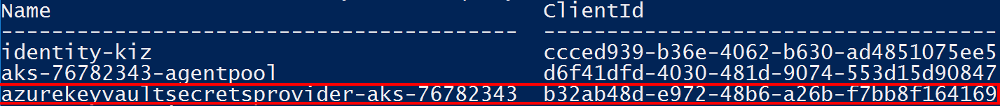

# Secret Integration with Key Vault
https://medium.com/@shivanik111898/use-azure-key-vault-for-secret-store-with-azure-csi-driver-31bc803b7ca8


6. Create a sample secret for testing

```PowerShell
az keyvault secret set `
   --vault-name $KV_NAME `
   --name dbConnection  `
   --value "Highly sensitive information: <place data here>"
```

7. Verify the secret is in the Key Vault

```PowerShell
az account set --subscription 0e9d74fe-17e8-456f-a6e2-bd7602010688

az keyvault secret list --vault-name my-kv-rr -o table
```

You should now see the secret listed.

### Task 3 - Assign Permissions to AKS to read Secrets from Key Vault

You'll need to assign AKS the **Key Vault Secrets User** role so it's able to read the secrets you created.

1. List all available identities. Find the managed identity created for accessing the Key Vault from AKS when the addon was enabled.

```PowerShell
az identity list --query "[].{name:name,ClientId:clientId}" -o table
```



2. Get the object id of that managed identity AKS is using

```PowerShell
$KV_IDENTITY=(az identity list --query "[? contains(name,'azurekeyvaultsecretsprovider')].{principalId:principalId}" -o tsv)
$KV_CLIENT_ID=(az identity list --query "[? contains(name,'azurekeyvaultsecretsprovider')].{clientId:clientId}" -o tsv)
```

3. Assign the AKS identity permission to read secrets from the Key Vault.

```PowerShell
az role assignment create `
   --role "Key Vault Secrets User" `
   --assignee-object-id $KV_IDENTITY `
   --scope $KV_ID
```

### Task 4 - Create Kubernetes resources and read secret from Key Vault

1. Gather the needed values

```PowerShell
$TENANT_ID=(az aks show --name web-routing-aks --resource-group web-routing-aks --query "{tenantId:identity.tenantId}" -o tsv)

write-host @"
Client Id: $($KV_CLIENT_ID)
Key Vault Name: $($KV_NAME)
Tenant Id: $($TENANT_ID)
"@
```


4. Replace the placeholders with the values listed above.

```yaml
apiVersion: secrets-store.csi.x-k8s.io/v1
kind: SecretProviderClass
metadata:
  name: azure-kv-secret
spec:
  provider: azure
  parameters:
    usePodIdentity: "false"
    useVMManagedIdentity: "true"
    userAssignedIdentityID: "2a4dd3ce-9abf-43ff-816e-eeed0af40720"
    keyvaultName: my-kv-rr
    cloudName: ""
    objects: |
      array:
        - |
          objectName: dbConnection
          objectType: secret 
          objectVersion: ""
    tenantId: "16b3c013-d300-468d-ac64-7eda0820b6d3"
```

5. Apply the manifest.

```PowerShell
kubectl apply -f spc.yaml
```

6. Review the contents of **pod-kv.yaml**.

```yaml
kind: Pod
apiVersion: v1
metadata:
  name: pod-kv
spec:
  containers:
    - name: busybox
      image: k8s.gcr.io/e2e-test-images/busybox:1.29-1
      command:
        - "/bin/sleep"
        - "10000"
      volumeMounts:
        - name: secrets-store01
          mountPath: "/mnt/secrets-store"
          readOnly: true
  volumes:
    - name: secrets-store01
      csi:
        driver: secrets-store.csi.k8s.io
        readOnly: true
        volumeAttributes:
          secretProviderClass: "azure-kv-secret"
```

7. Apply the manifest.

```PowerShell
kubectl apply -f pod-kv.yaml
```

8. View secret value in Pod

```PowerShell
kubectl exec -it pod-kv -- cat /mnt/secrets-store/dbConnection
```

You should now be able to see the content of the Key Vault secret you created earlier.

### Task 5 - Create a Kubernetes Secret from a secret in Key Vault

Many Kubernetes resources use _Secret_ resources (Ingress, Persistent Volumes, etc.). You can extend the configuration about to create a Kubernetes secret object when you mount the Pod.

1. Edit the **SecretProviderClass** you created earlier.

```PowerShell
code spc.yaml
```

Add the indicated section.

```yaml
apiVersion: secrets-store.csi.x-k8s.io/v1
kind: SecretProviderClass
metadata:
  name: azure-kv-secret
spec:
  provider: azure

  ########## Add this section #########
  secretObjects:
  - data:
    - key: MySecret
      objectName: SampleSecret
    secretName: k8s-secret
    type: Opaque
  ########## End of section #########

  parameters:
    usePodIdentity: "false"
    useVMManagedIdentity: "true"
  ...
```

2. Update the object.

```PowerShell
kubectl apply -f spc.yaml
```

3. Edit the Pod manifest. Notice the **_env_** section setting the environment variable.

```PowerShell
code pod-kv.yaml
```

```yaml
kind: Pod
apiVersion: v1
metadata:
  name: pod-kv
spec:
  containers:
    - name: busybox
      image: k8s.gcr.io/e2e-test-images/busybox:1.29-1
      command:
        - "/bin/sleep"
        - "10000"
      volumeMounts:
        - name: secrets-store01
          mountPath: "/mnt/secrets-store"
          readOnly: true

      ########## Add this section #########
      env:
        - name: SECRET_VALUE
          valueFrom:
            secretKeyRef:
              name: k8s-secret
              key: MySecret
      ########## End of section #########

  volumes:
    - name: secrets-store01
      csi:
        driver: secrets-store.csi.k8s.io
        readOnly: true
        volumeAttributes:
          secretProviderClass: "azure-kv-secret"
```

4. Since Pods are immutable, you'll have to delete it and then reapply the manifest.

```PowerShell
kubectl delete pod pod-kv
kubectl apply -f pod-kv.yaml
```

5. View the secret in the Pod.

```PowerShell
kubectl exec -it pod-kv -- printenv
```


6. Verify the Secret object has been created and is available for other Pods to use.

```PowerShell
kubectl get secret
```


7. Delete the Pod and the Kubernetes Secret object will also be deleted. Once an injected Secret is no longer referenced by any Pods, it's automatically deleted.

```PowerShell
kubectl delete pod pod-kv
```

```PowerShell
kubectl get secret
```

Once an injected Secret is no longer referenced by any Pods, it's automatically deleted.